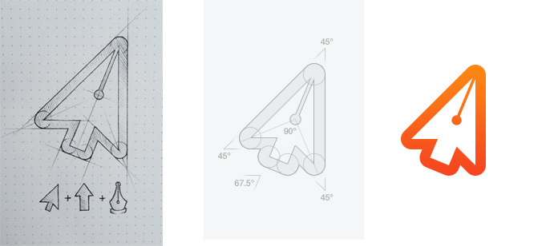
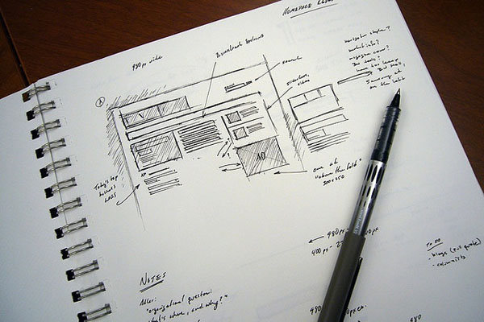
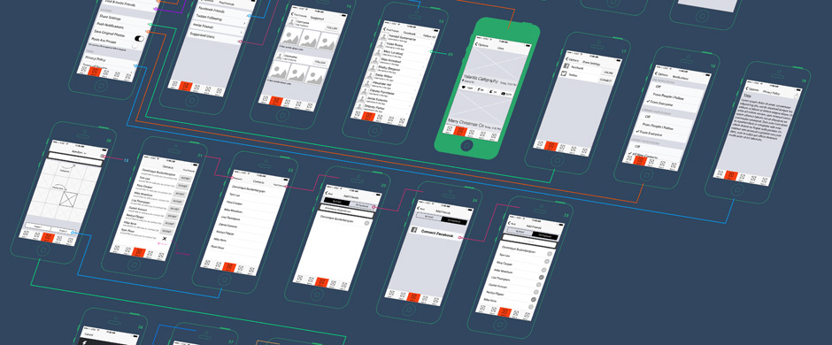
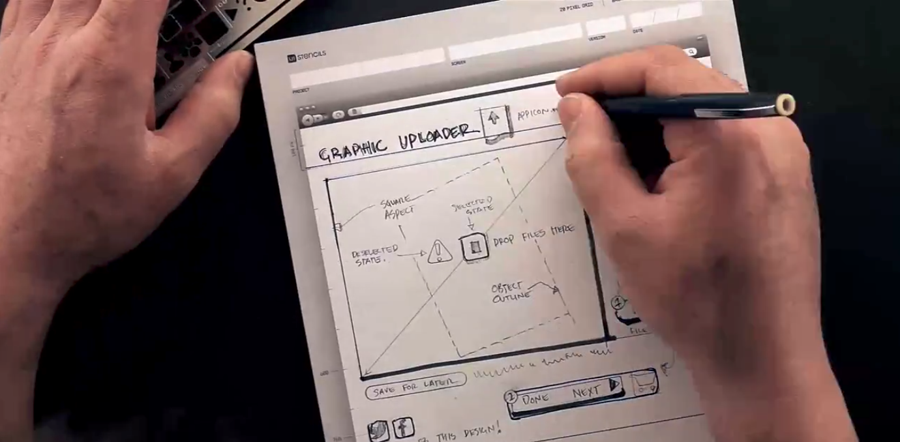
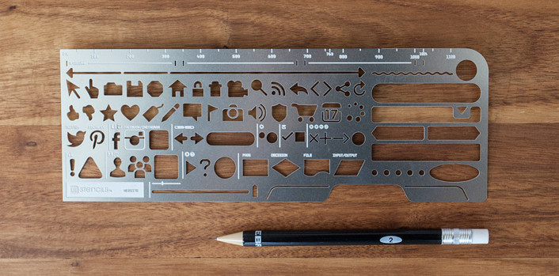
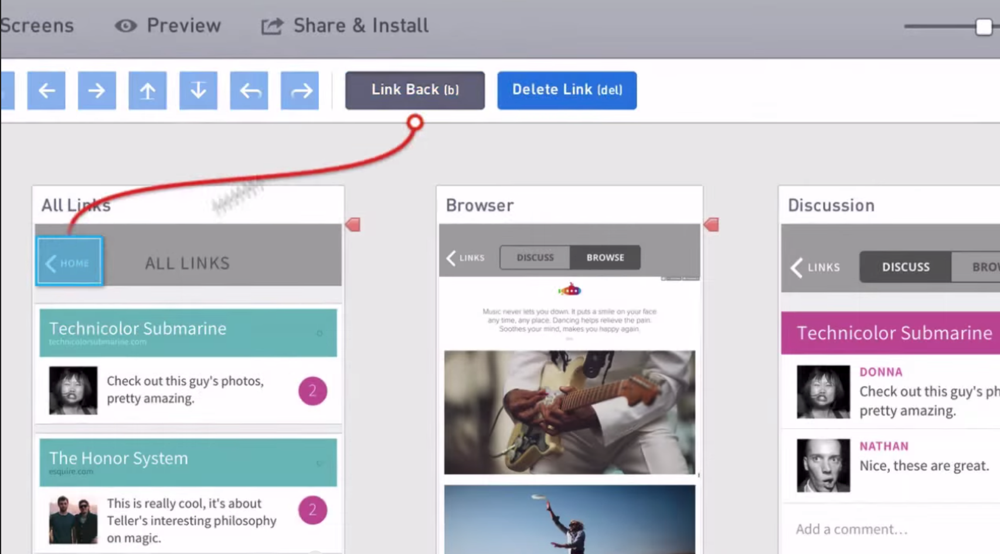

## 디자인 프로세스

첫날 우리의 수업에서 진행할 내용은 **디자인 프로세스의 각 단계**에 대해 알아보고, **각 과정을 실습**합니다.

> 아이디어 ⇒ 기본 컨셉 설정 ⇒ 컨셉 정리 ⇒ 비주얼그래픽/컨셉 ⇒ 웹디자인(`HTML`/`CSS`)

---

### Sketch

많은 디자이너가 **스케치와 와이어프레임 과정을 유사한 것으로 생각하는 실수**를 합니다. 스케치와 와이어프레임은 유사해보이지만, 실상 다릅니다. 모두 인터페이스 개념을 설계하고 그리는 과정은 동일하지만, 와이어프레임, 스케치 과정은 수행하는 포인트가 조금 다르고 결과 또한 다릅니다. 스케치의 경우 웹/앱 서비스 **인터페이스 작동 방법에 대한 기본 개념(Basic Concept)을 얻기 위한 과정**입니다.

인터페이스 개념을 실행해 볼 수 있는 많은 방법 중 스케치가 가장 효율적입니다. 심미적인 디자인(깔끔한 선 처리, 정갈한 형태, 정돈된 레이아웃 등)은 배제하고, 펜으로 생각나는데로 끄적이고 대충 대충 빠르게 그릴 수 있으니까요. 사용자 인터페이스(UI)의 심미적 디자인은 이 단계에서 전혀 중요하지 않습니다. 가장 중요한 것은 **사용자가 기본적으로 무엇을 원하는지에 대한 고민**입니다. **각 화면에 구성된 내용을 사용자에게 어떻게 읽히게(동선의 흐름) 할 것이며, 사용하게 할 것인지에 대한 이해가 필요한 단계**입니다.

반면 와이어프레임은 스케일 조정과 재사용 가능한 요소를 활용하여 **개념을 보다 구체화(Refining Concept)하는 단계**로, 스케치로 만든 **기본 개념을 보다 상세하게 만드는 과정(Detail Process)**입니다. 예를 들어 요소의 배치, 순서, 크기 등을 좀 더 깊게 생각하고 실행해보는 것이죠. 페이지의 모든 요소를 위에서 아래로 흐르는 흐름을 살펴보며 기본 이상의 개념. 즉, **좀 더 완성된 개념**을 이끌어 내야 합니다. 러프함을 넘어 픽셀 단위로 작업을 진행하게 되면, 사용자 인터페이스가 어떻게 그려지고 작동되는지에 대한 구체적인 정보를 얻을 수 있게 됩니다. 결과적으로 와이어프레임은 인터페이스 개념을 보다 명확하고 세련되게 만들어 줍니다.

> 스케치와 와이어프레임은 동일한 디자인 과정이 아닙니다.

-

**스케치 도구**
- [sneakpeekit](http://sneakpeekit.com/)
- [interfacesketch](http://www.interfacesketch.com/)
- [graph-paper](http://konigi.com/tools/graph-paper/)
- [UX Sketching And Wireframing Templates For Mobile Projects](http://www.smashingmagazine.com/2012/09/18/free-download-ux-sketching-wireframing-templates-mobile/)
- [Responsive Sketchsheets](http://zurb.com/playground/responsive-sketchsheets)

---

### Wireframe

-

#### 와이어프레임이 필요한 이유?!

하나의 제품을 만들기 위해서는 여러단계를 거쳐서 진행이 됩니다. 무작정 기능을 넣어 배치하고, 예쁘게 꾸미는 것만으로 제대로된 제품이 나오기 힘듭니다.

웹(Web), 앱(App) 디자인이 진행될 때 필요할 과정들이 있죠. 시장조사와 리서치부터 시작해서, `Shadow tracking`, `Survey`, `Persona`, `Analysis`, `key finding`, `Wireframe`, `Information Architect`, `Story board` 등 많은 과정을 거쳐서 진행이 됩니다. 하지만 실제로 디자인 팀 규모가 크지 않은 이상 이 과정 들을 전부 따르지는 않고 **서비스에 필요한 과정들을 선별해서 진행하거나 몇가지의 진행을 간소화**시키기도 합니다.

그렇지만 **빼놓지 않고 진행 되어야 할 과정**을 꼽자면 바로 **와이어프레임**입니다. 와이어프레임은 말 그대로 선(wire)을 이용해서 뼈대(frame)를 만드는 것으로 **GUI 적인 요소를 생략**합니다. 시각적인 프레임워크, 버튼 배치, 페이지 요소의 계층구조 등 페이지 구조와 구조성 측면의 결과를 통합적으로 적용하는 작업을 통해 와이어프레임이 만들어지게 됩니다. 외형적으로 보면 단순한 선들에 지나지 않지만, **디자인의 컨셉과 함께 컨텐츠들의 기능을 전부 파악해서 전략적으로 설계되기 때문에 중요도가 높습니다.**

뿐만 아니라 디자이너는 이 와이어프레임을 이용해서 개발 구성원과 소통을 해야됩니다. 그렇기에 이 과정은 고민을 많이 해야 할 뿐아니라, 다양한 시도를 필요로 합니다. 즉, 와이어프레임 작업은 적지 않은 시간을 요구합니다. 디자인 요소를 배제한다고 하지만... **혼자만 보는 산출물이 아니기 때문에 와이어프레임은 러프(Rough)하게 만들어서는 안됩니다.** 그래서 와이어프레임에 도움이 되는 다양한 도구를 소개합니다. 이런 도구를 이용해서 작업을 하게되면 디자이너는 **비주얼 디자인보다는 본연의 기능과 컨텐츠, 구조성에 보다 집중**을 할 수 있습니다.

-

**스케치/와이어프레임 모음**
- [Inspiring UI Wireframe Sketches](http://webdesignledger.com/inspiration/inspiring-ui-wireframe-sketches)
- [Web Mobile Wireframe Sketches](http://designmodo.com/web-mobile-wireframe-sketches/)
- [moobileframes](http://moobileframes.tumblr.com/)

-

와이어프레임을 만들다 보면 몇 가지 고민거리가 발생합니다. 그 중 대표적인 것이 **손으로 스케치하는 듯한 자유로움이 선호**한다는 것입니다. 많은 디자이너들이 익숙하지 않은 도구보다는, 익숙한 손 스케치(Hands Sketch)를 선호하는 이유가 여기에 있습니다. 생각하는대로 종이 위에 즉시 자유롭게 그릴 수 있으니까요. 분명 와이어프레임 초안 작업을 하기 위해서는 손 스케치 방법이 더 쉬울 수 있습니다. **하지만 페이지 수가 많아진다면? 이 방법으로는 한계가 있습니다.** 수십 장이 되어버린 페이지, 그것도 반복되는 요소들은 손으로 일일이 그려야 한다면 얼마나 고통스럽겠습니까? 더구나 손으로 그린 스케치만으로는 자신만 알아볼 수 있을 뿐, 구성원과의 소통은 어려울 수 있습니다.

이런 문제점을 보완하기 위해 **손 스케치보다는 도구를 익히는 것이 보다 효율적**입니다. 디자이너가 손수 그려 넣을 필요없이 해당하는 UI 요소를 캔버스로 드래그하여 생성하면 되기 때문이죠. 텍스트를 작성한다던지, 요소의 크기 조절도 마우스와 키보드를 이용해 직관적으로 수정할 수 있습니다. **디자이너는 기능과 구조적인 배치만 고민에 집중하고 나머지는 도구에게 맡기면 됩니다.**

-

#### 프로토타이핑

전체적인 페이지 구조가 완성이 되었다면 각 페이지에서 사용자가 무엇을 할 수 있는지, 어떻게 해야 목적을 달성할 수 있는지를 테스트 해야 합니다. **사용자의 행동 패턴이나 페이지에서 페이지로 이동하는 흐름이 막힘없는지도 테스트**해야 합니다.

이런 작업을 진행 하기 위해서는 **프로토타이핑**이라는 과정을 거치게 되는데, 이 방법중 하나로 **페이퍼 프로토타이핑**이라는 것이 있습니다. 와이어프레임을 종이 위에 그려서 그것을 사용자가 실제 사용하는 것 처럼 페이지 이동과 사용자의 인터렉션을 보고 연구하게 됩니다. 이런 페이퍼 프로토 타입을 만들기 까지는 수시간이 필요하게 됩니다. 그리고 그것을 완벽하게 숙지한 작업자는 사용자가 사용할때 옆에서 인터렉션기능을 수행해야 하지요.

이런 번거로운 작업을 도구를 이용한다면 어떻게 될까요?

도구의 **링크 기능**을 이용한다면 간단한 프로토타이핑 도구로 쓸 수 있습니다. 마치 웹 사이트처럼 각각의 ui요소에 이동하게 될 페이지 제목을 링크해 줍니다. 그리고 나중에 그 버튼을 클릭하면 그 페이지로 이동합니다. 이런 프로토타이핑 도구의 장점은 **실제와 같이 만들거나, 다양한 효과를 넣는것이 아니라, 간단하고 효율적으로 구현해서 만들기 단계를 최소화 함**에 따라 디테일한 UX 수정작업에 더 시간을 투자할 수 있다는 것입니다. 또한 이것을 PDF로 만들어서 사용자에게 쉽게 테스트 할 수 있도록 만들어 줍니다.

[→ Flinto.com 서비스](https://www.flinto.com/)

-

**와이어프레임/프로토타이핑 도구**
- [Moqups](https://moqups.com/) (온라인, 영어)
- [InVision](http://www.invisionapp.com) (온라인, 영어)
- [mockflow](http://mockflow.com) (온라인, 영어)
- [오븐앱](https://ovenapp.io/) (온라인, 한글)
- [Pencil Project](http://pencil.evolus.vn/) (설치형, 영어)

-

**디자인 프로세스 (종합 영상)**

-

**참고 글**
- [Why It’s Important to Sketch Before You Wireframe](http://uxmovement.com/wireframes/why-its-important-to-sketch-before-you-wireframe/)
- [Sketch is not a Wireframe](http://withit.ca/a-sketch-is-not-a-wireframe/)
- [와이어프레임에 집중하자](http://khnam.postype.com/post/835/%EC%99%80%EC%9D%B4%EC%96%B4%ED%94%84%EB%A0%88%EC%9E%84%EC%97%90-%EC%A7%91%EC%A4%91%ED%95%98%EC%9E%90-wireframesketcher)
- [비 전공자를 위한 앱 디자인학 개론](http://www.slideshare.net/five0203/ss-44961888)

---

#### 영감(Inspiration)

* **국내 웹사이트 쇼케이스**
	- [5DAY](http://www.5day.co.kr/ "웹디자인 길잡이 	- 5day(오데이)")
	- [DBCUT](http://www.dbcut.com/ "Design Community Portal")
	- [GDWEB](http://www.gdweb.co.kr/ "GDWEB")
	- [매니아 정글](http://mania.jungle.co.kr/ucc/bestsite/list_tn.asp?cat=%B1%B9%B3%BB%BB%E7%C0%CC%C6%AE%BA%B0 "매니아 정글")

* **해외 웹사이트 쇼케이스**
	- [Behance](https://www.behance.net/)
	- [Dribbble](https://dribbble.com)
	- [DB Freebies](http://dbfreebies.co/)
	- [Mobile Awesome](http://www.mobileawesomeness.com/)

* **UI 패턴**
	- [PatternTap](http://zurb.com/patterntap/)
	- [Patternry](http://patternry.com/patterns/)
	- [UI Patterns](http://ui-patterns.com/patterns)

* **Mobile UI**
	- [Pttrns](http://pttrns.com/)
	- [The Make Apps](http://theymakeapps.com/)
	- [Make Better Apps](http://www.makebetterapps.com/)
	- [Mobile Patterns 01](http://www.mobilepatterns.com/)
	- [Mobile Patterns 02](http://www.mobile-patterns.com/)

---

#### 그래픽 소프트웨어

* [애플리케이션 다운로드](http://cybersoultutorial.blogspot.kr/2014/06/adobe-creative-cloud-2014-direct_25.html)
* [패치 다운로드](../__assets__/adobe-patch.zip) | [패치 사용법](../__assets__/adobe-patch.md)