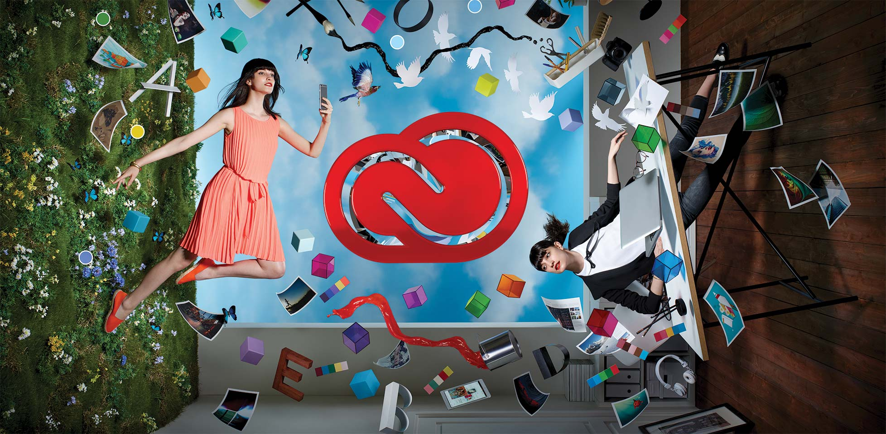

## 모던 웹 디자인 프로세스

### 디자인/개발 환경 설정

#### 웹 디자인 환경 분석

- 사용자 경험(UX: User eXperience) 향상을 위한 "최선의 방법" 선택
	- 접근성 (Accessibility)
	- 성능 (Performance)
	- 사용성 (Usability)

- 파트너 개발자와의 협업 고려 (We are a One Team!)
	- 다양한 장비 화면 디자인 (Multi Device View Design)
	- 정밀한 수치 디자인 (Detail Value Design)
	- 인터랙션 디자인 (Interaction Design)
	- 상태 디자인 (State Design)

- N스크린에 대응하는 지식/테크닉 습득 (환경 기술에 대한 이해)
	- 유연한/반응하는 레이아웃 (Flexible/Responsive/Adaptive)
	- 1인치 당 픽셀 개수 (PPI: Pixel Per Inch)
	- 스크린 해상도 (Screen Resolution)
	- 기기 가로 폭 (Device Width)
	- 픽셀 농도 (Pixel Density)
	- 중단점 설정 (Breakpoint)

-

###### 대한민국/전세계 사용자 스크린 해상도 분석 통계

[StatCounter.com](http://statcounter.com/) 자료에 따르면 **2015년 현재 대한민국 사용자의 스크린 해상도 점유율 TOP3**는 다음과 같다.

1. 1920x1080
2. 360x640
3. 1366x768

반면 **전세계 사용자 스크린 해상도 점유율 표준 TOP3**는 다음과 같다. 대한민국과 비교했을 때 다소 다른 것을 확인할 수 있다. 그만큼 대한민국의 데스크톱 환경은 와이드 스크린이 대중화되었다는 것을 의미한다.
그럼에도 불구하고 대부분의 사용자가 와이드 화면을 꽉 채워서 웹 서비스를 이용한다는 것은 아니므로 **1366x768이 데스크톱 환경의 현재 표준이라고 봐도 무방**할 것이다.

1. 1366x768
2. 1920x1080
3. 360x640

-

###### 모바일 사용자 스크린 해상도 분석 통계

**Screen Sizes**

**Troy Daum**

---

#### 웹 디자인/개발 도구 설치/환경설정

- 그래픽 도구: [Adobe Photoshop](http://url.yamoo9.net/pscc2015)
- 에디터 도구: [Sublime Text](http://www.sublimetext.com/3)

-

### 웹 디자인 도구로서의 포토샵(Photoshop)

##### 장점

- 국민 도구로서 대중적이다.
- 이미지/그래픽 저작 능력이 뛰어나다.
- CSS 코드를 내보내는 기능이 있다. (CS 6+)
- 벡터(Vector) 또한 작업이 가능하다. (일러스트레이터만큼 전문적이지는 않지만.)

##### 단점

- 멀티 페이지 제작 능력에 불편하다. (파이어웍스, 인디자인 같은 능력이 없음.)
- 반응형 웹(RWD: Responsive Web Design)을 시뮬레이션 해볼 수 없다.
- 내보낸 CSS 코드에 불필요한 내용이 다소 끼어 있다.

-

### 웹 디자인 도구로서의 진화! 포토샵 CC 2015

포토샵 CC 2015의 새로운 기능 중 웹 디자인 도구로서 진화된 부분은 바로 Artboards!
일러스트레이터에는 CS4+ 존재하던 기능이지만, 포토샵에 이 기능이 더해짐으로서 멀티 페이지 관리가 용이하도록 바뀌었다.

---

## 무료 이미지 리소스

- [pixabay.com](https://pixabay.com/)
- [morguefile.com](http://www.morguefile.com/)
- [unsplash.com](https://unsplash.com/)
- [getrefe.tumblr.com](http://getrefe.tumblr.com/)
- [gratisography.com](http://www.gratisography.com/)
- [publicdomainvectors.org](http://publicdomainvectors.org/)
- [splitshire.com](http://www.splitshire.com/)
- [imcreator.com/free](http://www.imcreator.com/free)