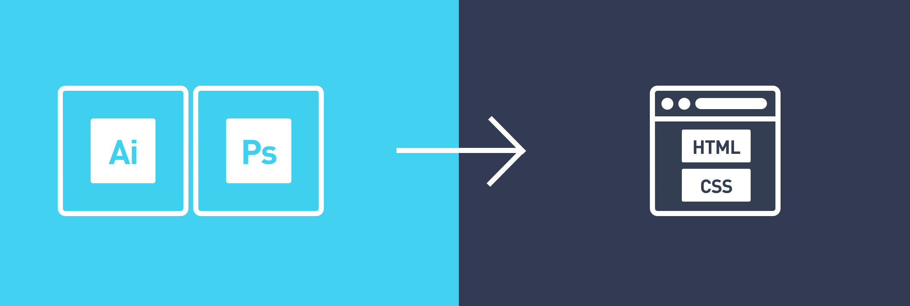

### 코딩이 두려운 웹 디자이너를 위한 PSD → HTML+CSS

디자이너에게 배우는 웹 디자인 제작 방법론(PSD 제작 & HTML+CSS).

웹 타이포그래피/그리드시스템/버티컬리듬을 기반으로 하는 모던 웹 디자인 방법론을 배워봅니다. 방법론을 도입한 웹 시안 Photoshop 파일(PSD)을 디자인한 후, 웹 데이터(HTML/CSS)로 제작해보는 과정을 공부하게 됩니다. 디자인부터 제작까지 흥미로운 여정이 되겠지요. ^ㅡ^

<!--  -->

---

### Agenda
* [01일차](DAY01/README.md)
* 02일차
* 03일차
* 04일차
* 05일차
* 06일차
* 07일차
* 08일차
* 09일차
* 10일차
* 11일차
* 12일차
* 13일차
* 14일차
* 15일차
