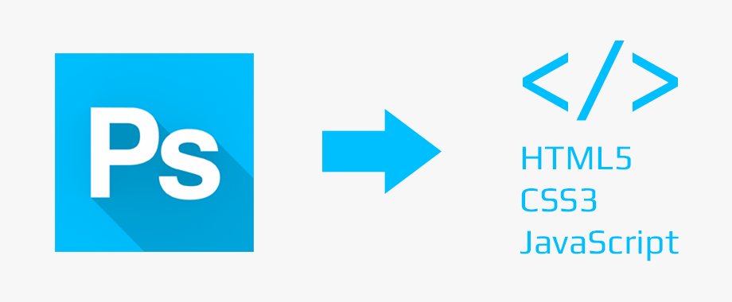

### 코딩이 두려운 웹 디자이너를 위한 PSD → HTML+CSS

웹 타이포그래피/그리드시스템을 기반으로 하는 디자인 방법론을 토대로 Photoshop 파일(PSD)을 제작해보고, 웹 데이터(HTML, CSS)로 제작해보는 과정을 공부합니다.

---

### Agenda
* [01일차](DAY01/README.md) `디자인 프로세스`
* [02일차](DAY02/README.md) `웹 타이포그래피`
* 03일차
* 04일차
* 05일차
* 06일차
* 07일차
* 08일차
* 09일차
* 10일차
* 11일차
* 12일차
* 13일차
* 14일차
* 15일차