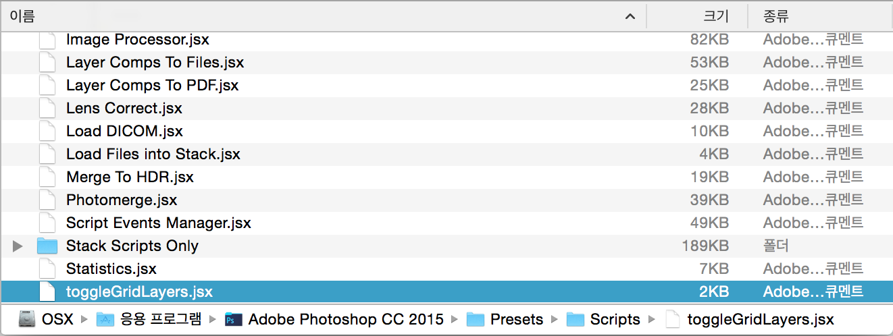
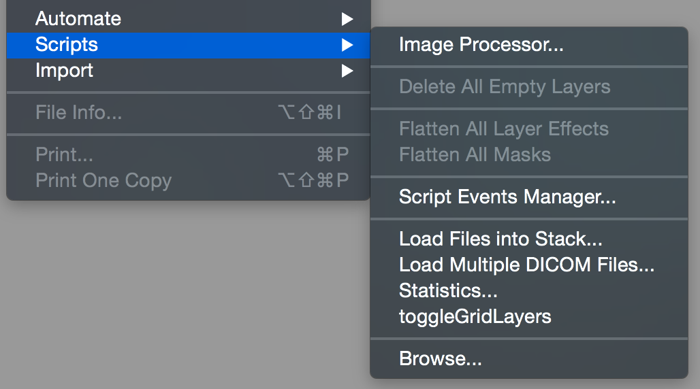

# Photoshop Script - toggleGridLayers.jsx

`toggleGridLayers.jsx` 파일을 설치된 Photoshop 폴더 내부 `Presets/Scripts` 안에 복사/붙여넣기 합니다.

-

Photoshop 앱을 구동합니다.

-

Photoshop 앱 메뉴 `File > Scripts > toggleGridLayers` 명령에 적절한 단축키를 설정합니다. (Action 또는 Keyboard Shortcuts 활용)

