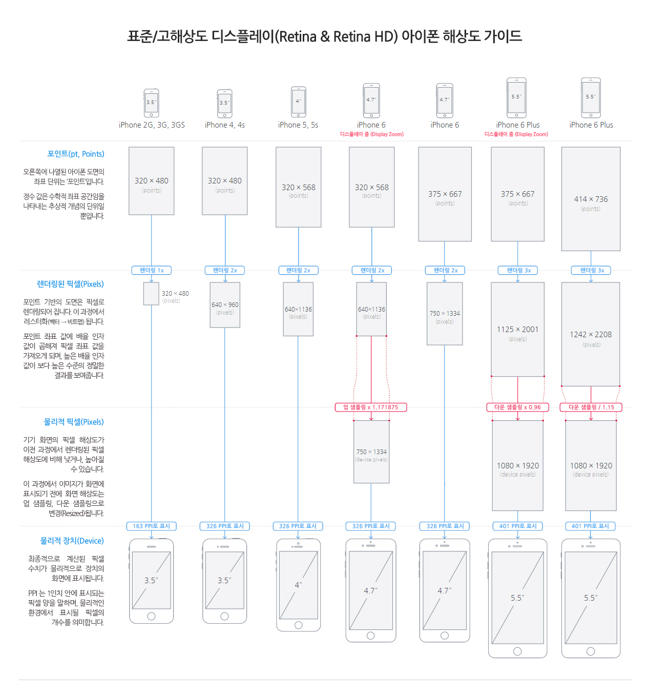
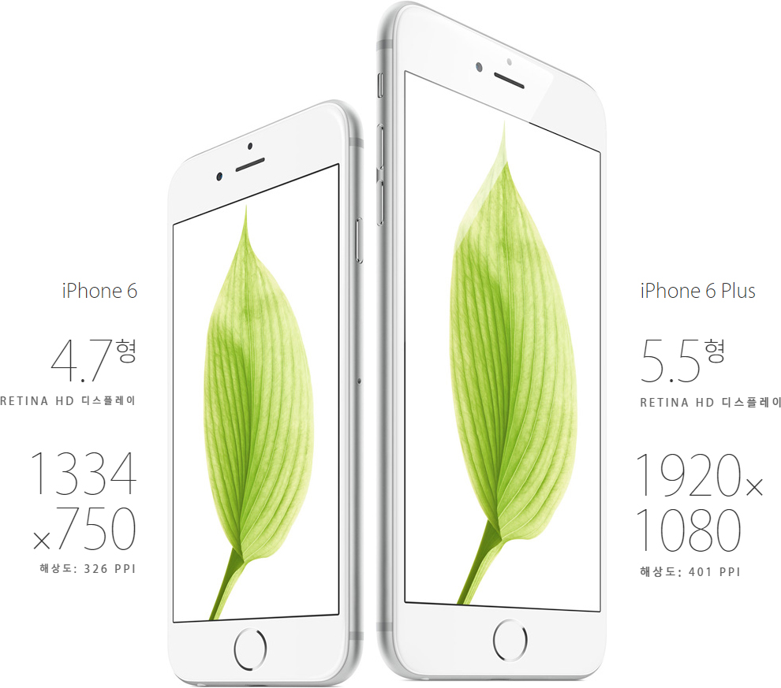
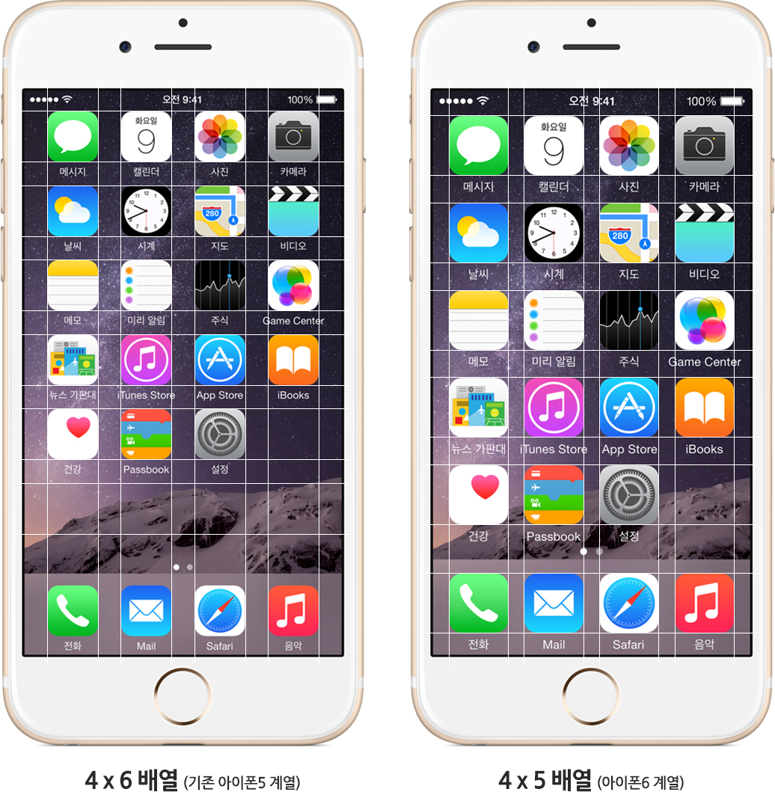

## Retina Display 가이드 참고자료
- [Apple: iPhone6 Display](http://www.apple.com/kr/iphone-6/display/)
- [Designers Guide to DPI](http://sebastien-gabriel.com/designers-guide-to-dpi/home)
- [Ultimate Guide to iPhone Resolutions](http://www.paintcodeapp.com/news/ultimate-guide-to-iphone-resolutions)
- [LayerCraft](http://lab.rayps.com/lc/)

### 레티나 디스플레이 HD(Retina Display HD)
아이폰6, 6+부터 레티나 디스플레이 HD가 적용된 점은 같으나, 해상도는 다릅니다. 아이폰 6+부터는 기존 해상도(326 PPI)보다 높은 401 PPI가 적용되었습니다. 아이폰6는 기존 5와 같은 배율(x2)이지만 물리적인 크기가 4.7인치로 변경되어 화면 크기가 커진 것인 반면, 아이폰 6+는 물리적인 크기 또한 5.5인치로 커지고, 배율(x3) 또한 변경되어 1080x1920 (다운샘플링된 결과)까지 화면 처리됩니다.

### 디스플레이 줌(Display Zoom)
아이폰 디스플레이 보기 설정으로 한 화면에 출력 가능한 아이콘의 개수를 변경하며, 콘텐츠 역시 뷰에 따라 크기를 달리해서 볼 수 있습니다.
